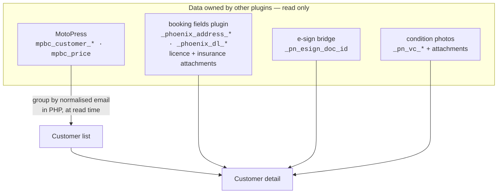

# Phoenix Nest — Customer Records


A **read-only** WordPress admin screen set that answers the question a booking plugin can't: *"show me this customer — every rental they've ever taken, with the licence they showed, the agreement they signed, and the condition photos of the car."*

It groups bookings into customers, filters them by name or rental date, and assembles one page per customer from data owned by three other plugins. **It writes nothing.**

> **Live in production:** [phoenixnest.properties](https://phoenixnest.properties) — Phoenix Nest Properties LLC (Destin, FL vehicle rentals).

---

## Why this exists

MotoPress Booking Calendar — including the paid version — **has no customer entity.** There is no Customers screen, no customer ID, no table to join. A customer exists only as three meta values on each booking:

```
mpbc_customer_name · mpbc_customer_email · mpbc_customer_phone
```

So a repeat renter is not one record with three rentals; they are three unrelated bookings that happen to share a string. Anything the owner wants to know about a *person* — how many times they've rented, what they've spent, whether their licence has expired since last time — is unanswerable without building the grouping yourself.

That grouping is the whole plugin, and **the choice of key is the whole design**:

| Candidate key | Verdict |
|---|---|
| **Normalised email** (`strtolower(trim())`) | **Chosen.** The only near-stable, near-unique field a booking carries |
| Name | Rejected — "Mike Ortiz" and `michael ortiz ` are two people |
| Phone | Rejected — formatting varies too much to key on |

Consequences are accepted out loud rather than hidden: one person booking under two emails is two records, and a booking with no email is surfaced in an **Unassigned** bucket instead of silently vanishing.

---

## Architecture



There is **no taxonomy, no backfill, and no `save_post` hook.** Grouping is a single query and a `foreach` at read time, which means every existing booking appears the moment the plugin is activated — nothing to migrate, and no write path to audit.

### Screens

**Customer list** — a stat strip (customers, rentals, revenue, photo pairs) that describes *what's on screen* so it stays meaningful under a filter; then the table: initials avatar, stacked contact cell, rentals, first/last rental, condition-photo completeness as a progress bar, and total spend.

Filters are free-text (name / email / phone) and a rental **date range** — the range matches customers having *any* rental in the window, because "did this person rent in March" is the question actually being asked.

**Customer detail** — identity header with `mailto:`/`tel:` chips, a stat strip, then one card per rental with three sections: *Rental & renter*, *Identity documents & agreement*, *Condition photos* (every photo labelled with its slot).

> **Renter details live inside each rental block, never hoisted to the header.** Address, licence number and expiry are a **per-booking snapshot**, not customer attributes — they can differ between rentals, and *"which licence did they show in March?"* is exactly what a dispute asks.

---

## Security model

- **Its own capability**, `pn_view_customer_records`, granted to `administrator` at activation — deliberately **not** `edit_posts`. This screen concentrates date of birth, home address, licence number and licence *images* for every customer in one place, which makes it the highest-value target on the site the moment a lower-privileged account exists. A user without the capability gets `wp_die()` and never sees the menu item.
- **Read-only, provably.** The code contains no write to any booking, attachment or document; the only write of any kind is the capability grant. The acceptance check is external: browse every screen, then confirm no booking's `post_modified` changed.
- **No email addresses in URLs.** Customer detail links key on `md5(email)`, so addresses stay out of server logs and browser history.
- **The agreement PDF is streamed through this plugin, never linked directly.** Every PDF URL WP E-Signature exposes is a bearer token that needs no login — printing one into an admin page would put it in browser history and every screenshot. Up to v1.1.0 this linked `admin.php?page=esigpdf&did=…`, assuming that was the login-gated equivalent; it is not, because E-Signature 2.1.3 ships that admin page with its registration commented out (`esig-save-as-pdf/admin/esig-pdf-admin.php:38`), so the slug is unregistered and WordPress answers every request — admins included — with *"Sorry, you are not allowed to access this page."* Since v1.2.0 the button points at a nonce'd, capability-checked route in this plugin, which fetches the bearer URL **server-side** and passes the bytes through. The token never reaches the browser, and the URL is built with E-Signature's own `default_link()` rather than a hardcoded page slug.
- **Everything is escaped at output** — every displayed string is customer-supplied.

---

## Installation

```bash
# From wp-content/plugins/
git clone https://github.com/codebyshoaib/phoenix-customer-records.git
```

Or upload the ZIP via **Plugins → Add New → Upload Plugin**, then **Activate**. There is nothing to configure — customers appear as soon as bookings exist.

**Requirements:** WordPress 5.7+, PHP 7.4+, MotoPress Booking Calendar. The renter-fields, agreement and condition-photo blocks light up if those plugins are present and degrade to "none recorded" if they aren't.

---

## Engineering notes

- **Group in PHP; skip the taxonomy.** An earlier design used a private taxonomy for counts and pagination. At real volume for a single-vehicle fleet that is pure ceremony, and dropping it removed three problems at once: no risk of a carelessly registered taxonomy publishing the customer list via term archives and REST, no backfill, and **no `save_post` write** — which is what makes the read-only claim airtight instead of "read-only except one thing".
- **Self-contained by choice.** It reads the other plugins' **meta keys, never their functions**. That costs a duplicated ~12-line attachment query and buys real isolation: a fatal here can only ever kill this one admin screen, and deactivating a sibling degrades a block rather than breaking the page.
- **Two kinds of timestamp.** Pickup/return are **wall-clock** values from a `datetime-local` field — no timezone to convert *from* — while the photo locks are server time. Mixing them displays an 8 am pickup as 4:00 am. `pn_cr_fmt_local()` and `pn_cr_fmt()` are separate for that reason.
- **Completeness counts pairs, and stays neutral until it's done.** A pickup set with no return set is half a before/after and isn't evidence of anything. Rendering every incomplete row in red makes the colour meaningless, so it's a quiet progress bar that turns green only when the pair is genuinely complete.
- **Styles are inline, deliberately.** One admin screen doesn't justify an HTTP request, and an enqueued file needs a version bump on every tweak or a CDN serves the stale copy. Inline CSS cannot go stale. It also styles **with** wp-admin — same greys, same buttons, `.wp-list-table` — because wp-admin is a coherent design system worth leaning on.
- **`'post_status' => 'any'` is a trap.** It expands to statuses registered `exclude_from_search => false`, and booking plugins register their own. `'any'` can return zero rows with no error. Enumerate instead.
- **Watch the PHP function-hoisting trap.** A top-level `if ( function_exists('…') ) return;` guard is always true, so the file returns before registering any hook — functions exist, nothing is wired, nothing errors. The self-test asserts the registrations.

---

## Tests

```bash
php tests/selftest.php     # → OK (64 assertions)
```

No framework, no WordPress. It asserts the ways the grouping goes quietly wrong — two people merged into one record, one person split in two, a booking with a typo'd email disappearing — plus the search and date-range edges (inclusive bounds, open-ended bounds, garbage bounds filtering nothing rather than everything), the four states an agreement link can be in, and that a licence scan sharing `post_parent` with condition photos is never counted as one.

---

## Part of a four-plugin system

Each plugin owns one job and one set of meta keys, so a bug in a reporting screen can never take down the booking flow. This one is the reporting screen — and being read-only makes it the cheapest to isolate and the safest to iterate on.

| | Plugin | Job |
|---|---|---|
| 1 | *Custom booking fields* (site-specific, not published) | Injects and saves renter fields on the booking form → `_phoenix_*` |
| 2 | **[phoenix-esign-bridge](https://github.com/codebyshoaib/phoenix-esign-bridge)** | Booking → pre-filled agreement → signed PDF, and records which document belongs to which booking |
| 3 | **[phoenix-vehicle-condition](https://github.com/codebyshoaib/phoenix-vehicle-condition)** | Pickup + return condition photos at handover → `_pn_vc_*` |
| 4 | **phoenix-customer-records** (this repo) | Read-only: groups every booking into customers and shows all of the above in one place |

One dependency worth knowing: the agreement link needs `_pn_esign_doc_id`, which the bridge only records for documents signed **after** that feature went live. Older bookings read *"not linked"* permanently — a link that was never recorded cannot be backfilled.

---

## Author

**Shoaib Ud Din** — Full-stack engineer
[LinkedIn](https://www.linkedin.com/in/shoaibbb/) · [GitHub](https://github.com/codebyshoaib)

## License

[GPL-2.0-or-later](LICENSE) — consistent with the WordPress plugin ecosystem.
